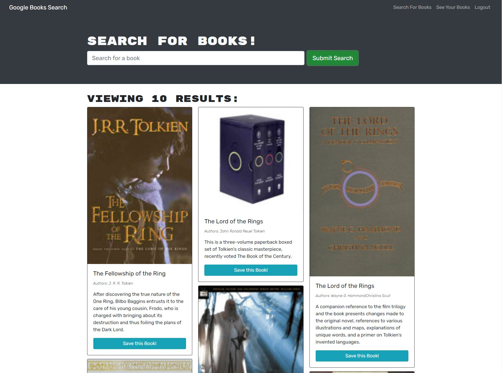

# Book_Search_Engine

## Description

This project involved turning a Google Books API search engine app with a RESTful API into a GraphQL API build utilizing Apollo Server. It is in the form of a MERN stack. The Apollo Server is set up to use GraphQL queries and mutations for data retrieval and manipulation. The authentication middleware has been adjusted to work with the GraphQL API. Lastly the app is set up with MongoDB Atlas and deployed to Heroku.

On opening the app you will be presented with an input field and button for searching for books and a navigation bar with links for Search for Books and Login/Signup. Searching for a book will present with results with information about the books found. Selecting Login/Signup presents a modal with a toggle between the two options. Signup requires a username, email, and password. Login requires email and password. If you're logged in, on the search results you can select to save books. Also, the nav bar will now have a link to see your books, between Search for Books and Logout. Selecting to see your books will display information for any books you've previously searched for and opted to save those books. On this page you'll have an option to delete books so they no longer present in your saved books.

## Table of Contents

1. [Description](#description)
2. [Installation](#installation)
3. [Usage](#usage)
4. [License](#license)

## Installation

First you will need to fork, then clone, the repository to your local, and make sure you're ready to use Node.js, Mongo, and Mongoose. Note that the package.json at the top level has scripts to make installing and running the app more convenient. Now, open the integrated terminal in the Book_Search_Engine directory and in the command line enter "npm install" to install the necessary dependancies. This will install dependencies for client and server sides. Now you can enter "npm run develop", this will run the server side and client side concurrently. These commands and their terminal responses are shown below. For the sake of brevity the image shows a reinstall, a fresh install will have a longer response.  
  

## Usage

You can access the app by installing and starting it, then navigating to the localhost port. You can also access the live app [here](https://obscure-beyond-37155.herokuapp.com/). Upon navigating to the app you will see a home page that looks like the following image.

  

Searching for a book without being signed in will look similar to the below.

  

Selecting Login/Signup will bring up a modal. Having Login toggled is shown, followed by the Signup option.

  

  

Searching while logged in will look like the below. Note the Save this Book! option, also the nav bar now shows links for Search For Books, See Your Books, and Logout.

  

The following shows the See Your Books page after choosing to save several books. Note the Delete this Book! option.

  

You can check out the deployed app [here](https://obscure-beyond-37155.herokuapp.com/).

## License

The license under which this project is covered is the MIT License. Learn more about that license [here](https://choosealicense.com/licenses/mit/).
